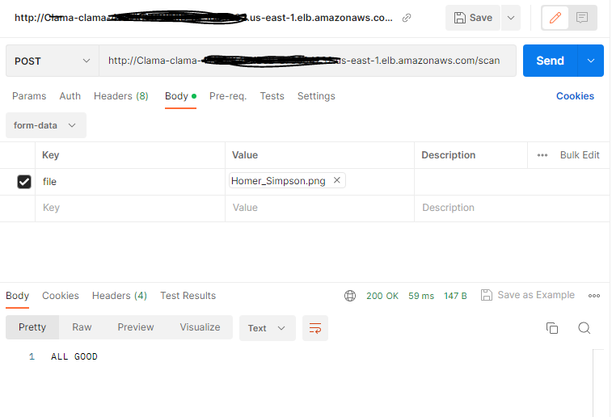

# An example implementation of ClamAV (Anti-Virus) as a REST application

In this example we are deploying ClamAV Virus Scanner to AWS and also exposing it as a REST service.  This approach enabled an application to send a file over API to ClamAV to return a pass/fail information.

## Implementation Details
This example is using a REST api using a Spring Boot application.  Dependencies:
* Spring Boot
* ClamAV application
* Java 17
* AWS CDK
* AWS ECS

## Steps to run
* Run the application to deploy the CDK Stack
* Call the API endpoint and pass in a file

## Results
If all goes well, we should see this:
* 
* 

### Notes
This is a simple implementation.  If there is a requirement for HA, the architecture will need to be changed.  Also implement TLS, observability, robust exception handling, server status, and other applicable requirements for making this Production ready. 